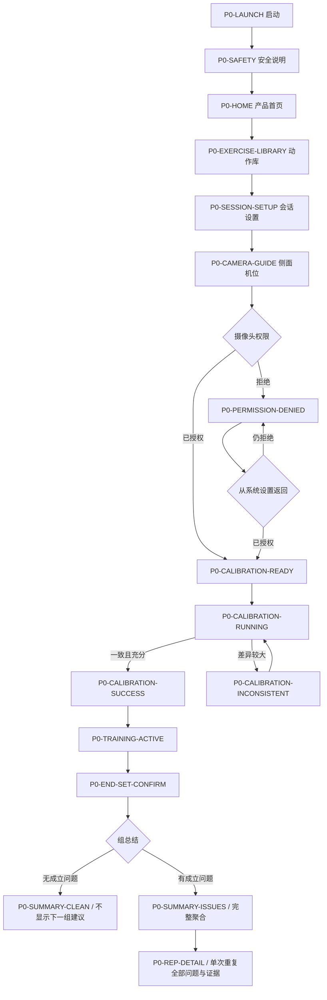
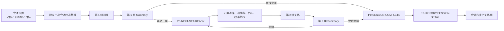
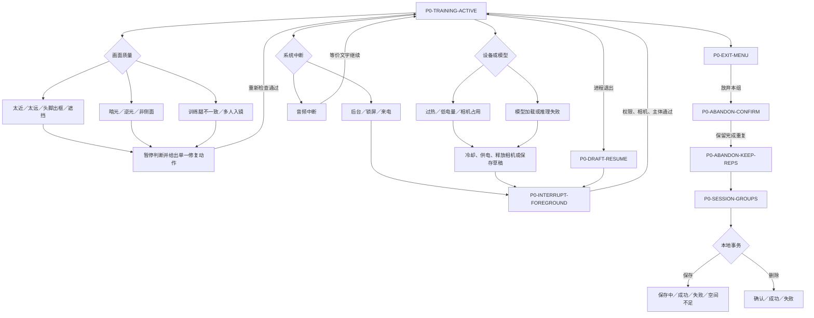
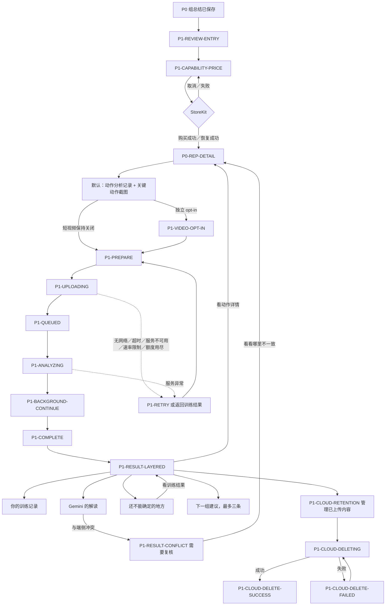

# AI 动作教练 v3 Flow Map

## P0 端侧主流程

P0 的实时计数、动作问题和可靠性判断完全在端侧完成。完整且证据充分的重复即使存在问题也计数；证据不足时显示“无法可靠判断”或保持沉默。

## 训练会话与多组流程

只有会话级设置发生会影响基线的变化时，产品才要求重新校准；普通“再做一组”不重复设置和校准。

## 系统异常与恢复

恢复原则：会话设置、会话基线和已经成立的重复事实不会因中断而被重算或静默丢弃。

## P1 Gemini 高级复盘流程

P1 只能在组结束后异步运行。端侧计数和客观问题是不可覆盖的事实层；Gemini 的解释、不确定内容和冲突单独呈现。
